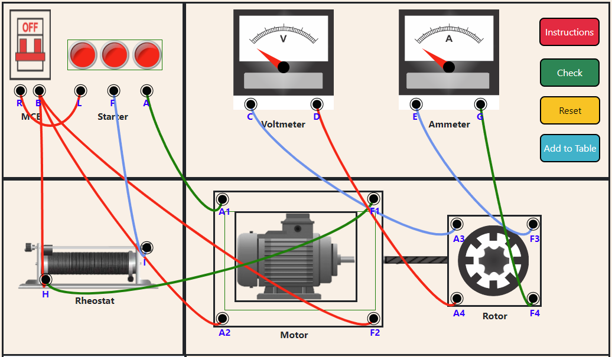

1. Make the correct connections- 
Connect MCB (-) to Rheostat (1) 
Connect MCB (-) to Motor (A2) 
Connect MCB (-) to Motor (F2) 
Connect MCB (+) to Starter (L) 
Connect Starter (A) to Motor (A1) 
Connect Starter (F) to Rheostat (2) 
Connect Rheostat (1) to Motor (F1) 
Connect Voltmeter (1) to Generator (A3) 
Connect Voltmeter (2) to Generator (A4) 
Connect Ammeter (1) to Generator (F3) 
Connect Ammmeter (2) to Generator (F4) 

2. Click on <b>"Check"</b> button, to check if the connections are correct or not. 

  
 
3. If the connections are wrong, then click on <b>"Reset"</b> button to again make the connections. 
 

  
 
4. If the connections are correct, then click on the MCB switch to turn it on.
 

 
 
5. Move the slider on the Rheostat to take observations from Voltmeter and Ammeter.
 

 
  
6. Click on <b>"Add to Table"</b> button, to record the observations in the table.

<li style= "margin-left:2em">NOTE: Atleast 6 observations should be added in the table.</li> 

   
  
7. When atleast 6 observations are taken, Click on<b> "Plot-Graph"</b> button to make the graph.
 

   
 

