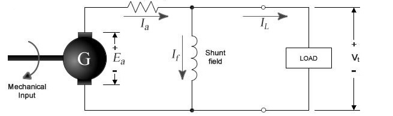
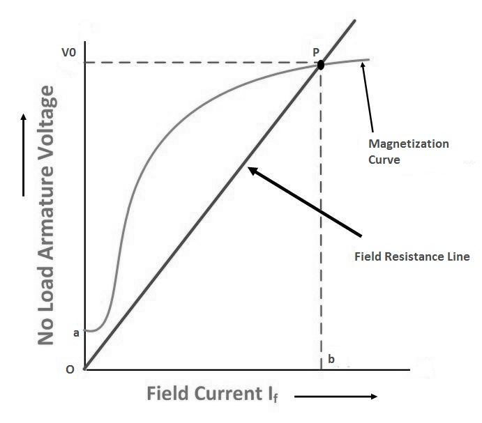

### Introduction 
A DC generator, whose schematic equivalent circuit is shown in figure 1, is an electrical machine that converts the mechanical energy of a prime mover (e.g. DC motor, AC induction motor or a turbine) into direct electrical energy. The generator shown in figure 1 is self-exciting. It uses the voltage Ea generated by the machine to establish the field current If, which in turn gives rise to the magnetic-field flux Φ. When the armature winding rotates in this magnetic field so to cut the flux, the voltage Ea is induced in the armature. This voltage is commonly referred to as the armature electromotive force or EMF. The induced EMF is proportional to the rate of cutting the flux and is given by emf formula.  

<b>E = (N P ∅ Z)/(60 A)</b>
   

where, 

Φ = flux in webers 
n = armature speed in rpm  
Z = total number of armature conductors  
p = number of poles  
a = number of parallel paths 

  
 

Figure :  Equivalent circuit of DC shunt generator
 
The magnetic field necessary for generator action may be provided by (a) permanent magnets,  (b) electromagnets receiving their exciting current from an external source, and  (c) electromagnets being excited from the current obtained from the generator itself (like that shown in figure 4.1).  The use of permanent magnets is confined to very small generators. The electromagnetic excitations listed in (b) and (c) above give rise to generators having somewhat different types of characteristics. 

In the case of a compound generator, the series and shunt fields may be connected so as to aid each other, i.e. the fluxes set up by each will add up. 

An increase in the total flux will generate a greater EMF. Such a connection is known as cumulative. If, however, the shunt and series windings are so connected that the flux set up by one opposes the other, then the induced EMF will be smaller. This type of connection is called differential. 

### Critical Field Resistance:

It is that value of the field resistance at which the D.C. Shunt Generator will fail to excite. 

It is that speed for which the given shunt field resistance becomes the critical field resistance. Critical field resistance is obtained by plotting the OCC as in fig.2 and determining the slope of the tangent to the linear position of the curve from the origin. While drawing the tangent, the initial position of the O.C.C is neglected. 
Due to residual magnetism in the poles, a small amount of EMF is generated even when If = 0. Hence the curve starts a little way up. The slight curvature at the lower end is due to magnetic inertia. It has seen that the first part of the curve is practically straight. Hence the flux and consequently generated EMF is directly proportional to the exciting current. However at the higher flux densities where it is small iron path reluctance becomes appreciable and straight. Field windings are connected parallel to the armature, so it is called DC Shunt Generator. Due to residual magnetism some initial emf and hence some current will be generated. This current while passing into the field coils will strengthen the magnetism of poles. This will increase pole flux which will further increase the generated emf. Increased emf and flux proceeds till equilibrium reached. This reinforcement of emf and flux proceeds till equilibrium reached at some point in the grapht between If and Eg*   

 

<b>Figure :  Magnetisation charateristics of DC shunt generator</b>
